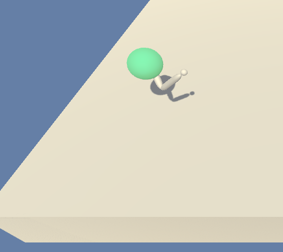

# Continuous Control Project



Within the Udacity Deep Reinforcement Learning nano-degree program, Continuous Control is the second major
project for students to build on their own.  The project is to build and train an agent using any policy-based techniques
to control the Reacher two-jointed robot arm in the Unity ML Agents environment.  The object is to move the arm
in such a way that its end point is always in the vicinity of the environment's moving target.  The target is
a sphere that randomly moves in a circular pattern in a plane parallel to the base table.  It moves either
clockwise or counter-clockwise, and varies its speed.  Sometimes it is essentially stationary.  This is not an
episodic task, so we arbitrarily limit trajectory length to a certain number of time steps and call it an episode.

The agent's possible actions comprise a vector of 4 real numbers in [-1, 1], which represent rotations of each
of the two arm joints.  The environment provides a state vector of 33 real values representing the sphere's
position and velocity as well as the positions, velocities and accelerations of each arm segment.  The arm is
not spatially constrained, and can fold back on itself (i.e. both segments can exist in the same space).  The
agent collects a small reward for each time step that the arm's end is "within the target vicinity".
Empirical evidence suggests that this means the end is within the target sphere.  The goal is to achieve an
average score of +30.0 or more over 100 consecutive episodes (there is no guidance on how long these episodes
must be).  **Note:** The [ML Agents site](https://github.com/Unity-Technologies/ml-agents/blob/master/docs/Learning-Environment-Examples.md#reacher) indicates the reward is 0.1 point per time step near the target.
However, this documentation is inconsistent with the version of code being used here.
My observation of the operating agent shows that the reward is actually 0.04 per time step within the sphere, so for an
episode of 1000 time steps the maximum possible reward would be 40 points.


I use the DDPG algorithm to train the agent.  The project report with additional details can be found in the Jupyter notebook, _Report.ipynb_ , located in this project directory.

### To use this code

The environment needed to run the code can be set up in a few minutes.  Beyond installing Jupyter Notebook, here are the steps
(use of conda is optional, but Python 3.6 is mandatory):
```
conda create --name drlnd python=3.6
conda activate drlnd
```

Next, pick a location to clone this repository, clone it, install its dependencies, and set up the Jupyter kernel:
```
cd <location>
git clone https://github.com/TonysCousin/udacity-reacher.git .
pip install .
python -m ipykernel install --user --name drlnd --display-name "drlnd"
```
 
Finally, install the Unity ML-Agents environment pre-built for this project (which means you don't need to install Unity directly).
Download the environment [from here](https://s3-us-west-1.amazonaws.com/udacity-drlnd/P2/Reacher/one_agent/Reacher_Linux.zip),
place it in your project directory and unzip it.

Code for this project lives in two places within this directory.  The first is the Jupyter notebook,
_cont-ctrl-project.ipynb_ , with the main logic in the flat files, `ddpg_agent.py` and `model.py`.
Once these dependencies are in place, simply open the notebook, select the drlnd kernel, and
run the entire notebook.  It will train the agent given the hyperparameters that appear in the code, and
show a plot of its training history.

Also included in this repository are checkpoint files that hold the pre-trained models, one for the actor network
and one for the critic network.  The final two cells in the notebook will read in these files and play an inference
episode with the trained models.

